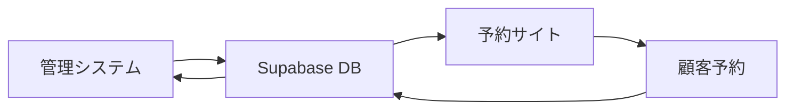

# 📱 予約サイト連携 API仕様書

## 📋 概要

管理システムと予約サイト間のデータ連携のためのAPI仕様書です。

## 🔗 データフロー



## 📊 データ構造

### 1. シナリオ情報 (BookingScenario)

```typescript
interface BookingScenario {
  id: string;
  title: string;
  description: string;
  author: string;
  duration: number; // 時間
  playerCountMin: number;
  playerCountMax: number;
  difficulty: number; // 1-5
  genre: string[];
  hasPreReading: boolean;
  participationFee: number;
  status: 'available' | 'maintenance' | 'retired';
  releaseDate: string;
  rating: number;
  playCount: number;
  imageUrl?: string;
  tags: string[];
}
```

### 2. スケジュール情報 (BookingSchedule)

```typescript
interface BookingSchedule {
  id: string;
  scenarioId: string;
  date: string; // YYYY-MM-DD
  startTime: string; // HH:mm
  endTime: string; // HH:mm
  venue: string;
  availableSlots: number;
  bookedSlots: number;
  gms: string[];
  category: 'オープン公演' | '貸切公演' | 'GMテスト' | 'テストプレイ' | '出張公演';
  isAvailable: boolean;
  notes?: string;
}
```

### 3. 店舗情報 (BookingStore)

```typescript
interface BookingStore {
  id: string;
  name: string;
  shortName: string;
  address: string;
  phoneNumber: string;
  email: string;
  capacity: number;
  rooms: number;
  status: 'active' | 'temporarily_closed' | 'closed';
  color: string;
  openingHours: {
    [key: string]: {
      open: string;
      close: string;
    };
  };
}
```

### 4. 予約情報 (BookingReservation)

```typescript
interface BookingReservation {
  id: string;
  scenarioId: string;
  scheduleId: string;
  customerId: string;
  customerName: string;
  customerEmail: string;
  customerPhone: string;
  participantCount: number;
  totalAmount: number;
  status: 'pending' | 'confirmed' | 'cancelled' | 'completed';
  createdAt: string;
  updatedAt: string;
  notes?: string;
}
```

## 🔌 API エンドポイント

### 1. シナリオ関連

#### GET /api/scenarios
利用可能なシナリオ一覧を取得

**クエリパラメータ:**
- `genre`: ジャンルフィルター
- `difficulty`: 難易度フィルター (1-5)
- `playerCount`: 参加人数フィルター
- `status`: ステータスフィルター

**レスポンス:**
```typescript
{
  scenarios: BookingScenario[];
  total: number;
  page: number;
  limit: number;
}
```

#### GET /api/scenarios/:id
特定シナリオの詳細情報を取得

**レスポンス:**
```typescript
{
  scenario: BookingScenario;
  schedules: BookingSchedule[];
  store: BookingStore;
}
```

### 2. スケジュール関連

#### GET /api/schedules
利用可能なスケジュール一覧を取得

**クエリパラメータ:**
- `scenarioId`: シナリオID
- `date`: 日付 (YYYY-MM-DD)
- `venue`: 会場
- `category`: カテゴリ

**レスポンス:**
```typescript
{
  schedules: BookingSchedule[];
  total: number;
}
```

#### GET /api/schedules/available
予約可能なスロットを取得

**クエリパラメータ:**
- `scenarioId`: シナリオID
- `date`: 日付 (YYYY-MM-DD)
- `participantCount`: 参加人数

**レスポンス:**
```typescript
{
  availableSlots: {
    date: string;
    timeSlots: {
      startTime: string;
      endTime: string;
      availableSlots: number;
      venue: string;
    }[];
  }[];
}
```

### 3. 店舗関連

#### GET /api/stores
利用可能な店舗一覧を取得

**レスポンス:**
```typescript
{
  stores: BookingStore[];
}
```

#### GET /api/stores/:id
特定店舗の詳細情報を取得

**レスポンス:**
```typescript
{
  store: BookingStore;
  scenarios: BookingScenario[];
}
```

### 4. 予約関連

#### POST /api/reservations
新しい予約を作成

**リクエスト:**
```typescript
{
  scenarioId: string;
  scheduleId: string;
  customerName: string;
  customerEmail: string;
  customerPhone: string;
  participantCount: number;
  notes?: string;
}
```

**レスポンス:**
```typescript
{
  reservation: BookingReservation;
  paymentUrl?: string;
}
```

#### GET /api/reservations/:id
特定予約の詳細情報を取得

**レスポンス:**
```typescript
{
  reservation: BookingReservation;
  scenario: BookingScenario;
  schedule: BookingSchedule;
  store: BookingStore;
}
```

#### PUT /api/reservations/:id/status
予約ステータスを更新

**リクエスト:**
```typescript
{
  status: 'confirmed' | 'cancelled';
  notes?: string;
}
```

#### DELETE /api/reservations/:id
予約をキャンセル

**レスポンス:**
```typescript
{
  success: boolean;
  message: string;
}
```

## 🔄 リアルタイム同期

### WebSocket イベント

#### シナリオ更新
```typescript
{
  type: 'scenario_updated';
  data: {
    scenarioId: string;
    changes: Partial<BookingScenario>;
  };
}
```

#### スケジュール更新
```typescript
{
  type: 'schedule_updated';
  data: {
    scheduleId: string;
    changes: Partial<BookingSchedule>;
  };
}
```

#### 予約作成
```typescript
{
  type: 'reservation_created';
  data: {
    reservation: BookingReservation;
  };
}
```

#### 予約キャンセル
```typescript
{
  type: 'reservation_cancelled';
  data: {
    reservationId: string;
    scheduleId: string;
    availableSlots: number;
  };
}
```

## 🛡️ セキュリティ

### 認証
- JWT トークンベース認証
- API キーによる認証
- レート制限 (100 req/min)

### データ保護
- HTTPS 通信
- 個人情報の暗号化
- アクセスログ記録

### バリデーション
- 入力データの検証
- SQL インジェクション対策
- XSS 対策

## 📊 監視とログ

### メトリクス
- API 応答時間
- エラー率
- リクエスト数
- データベース接続数

### ログ
- アクセスログ
- エラーログ
- セキュリティログ
- パフォーマンスログ

### アラート
- エラー率 5% 超過
- 応答時間 2秒 超過
- データベース接続エラー
- セキュリティ侵害

## 🧪 テスト

### 単体テスト
- API エンドポイント
- データ変換
- バリデーション

### 統合テスト
- データベース連携
- 外部API連携
- リアルタイム同期

### 負荷テスト
- 同時接続数: 1000
- リクエスト数: 10000/min
- データベース負荷

## 📚 使用例

### シナリオ一覧取得
```javascript
const response = await fetch('/api/scenarios?genre=推理&difficulty=3');
const data = await response.json();
console.log(data.scenarios);
```

### 予約作成
```javascript
const reservation = await fetch('/api/reservations', {
  method: 'POST',
  headers: {
    'Content-Type': 'application/json',
    'Authorization': 'Bearer ' + token
  },
  body: JSON.stringify({
    scenarioId: 'scenario-123',
    scheduleId: 'schedule-456',
    customerName: '田中太郎',
    customerEmail: 'tanaka@example.com',
    customerPhone: '090-1234-5678',
    participantCount: 4
  })
});
```

### WebSocket 接続
```javascript
const ws = new WebSocket('wss://api.example.com/ws');
ws.onmessage = (event) => {
  const data = JSON.parse(event.data);
  if (data.type === 'reservation_cancelled') {
    // 予約キャンセル時の処理
    updateAvailableSlots(data.data.scheduleId, data.data.availableSlots);
  }
};
```

## 🔧 実装ガイド

### 1. データベースビュー作成
```sql
CREATE VIEW booking_scenarios AS
SELECT 
    s.id,
    s.title,
    s.description,
    s.author,
    s.duration,
    s.player_count_min,
    s.player_count_max,
    s.difficulty,
    s.genre,
    s.has_pre_reading,
    s.status,
    sf.participation_fee,
    sf.license_amount,
    s.rating,
    s.play_count,
    s.release_date
FROM scenarios s
LEFT JOIN scenario_financials sf ON s.id = sf.scenario_id
WHERE s.status = 'available';
```

### 2. API ルート設定
```typescript
// app/api/scenarios/route.ts
export async function GET(request: Request) {
  const { searchParams } = new URL(request.url);
  const filters = {
    genre: searchParams.get('genre'),
    difficulty: searchParams.get('difficulty'),
    playerCount: searchParams.get('playerCount'),
    status: searchParams.get('status')
  };
  
  const scenarios = await getScenarios(filters);
  return Response.json({ scenarios });
}
```

### 3. リアルタイム同期
```typescript
// lib/realtime.ts
export function setupRealtimeSync() {
  const channel = supabase
    .channel('booking-sync')
    .on('postgres_changes', {
      event: 'UPDATE',
      schema: 'public',
      table: 'scenarios'
    }, (payload) => {
      // シナリオ更新時の処理
      broadcastUpdate('scenario_updated', payload.new);
    })
    .subscribe();
}
```

---

**作成日**: 2024年12月19日  
**更新日**: 2024年12月19日  
**作成者**: AI Assistant
